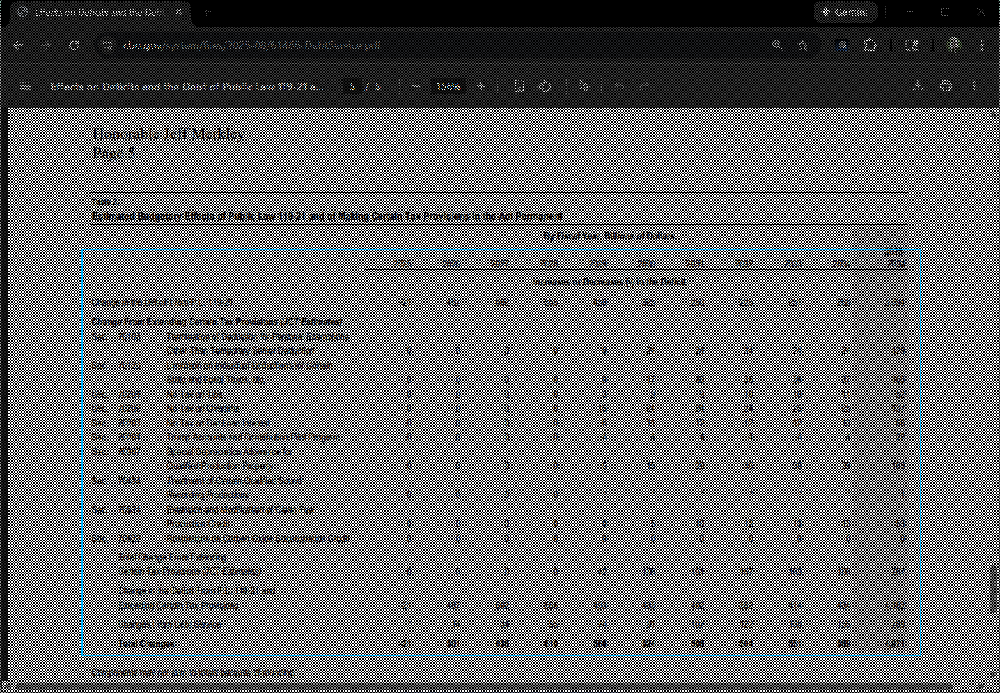
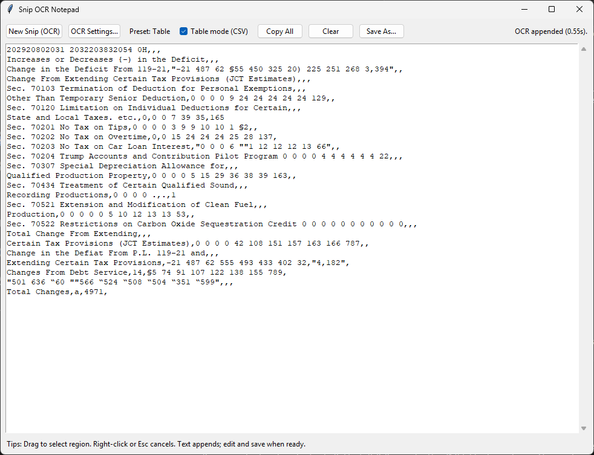
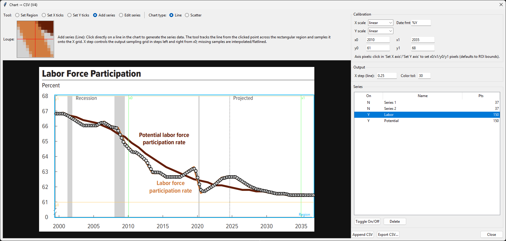
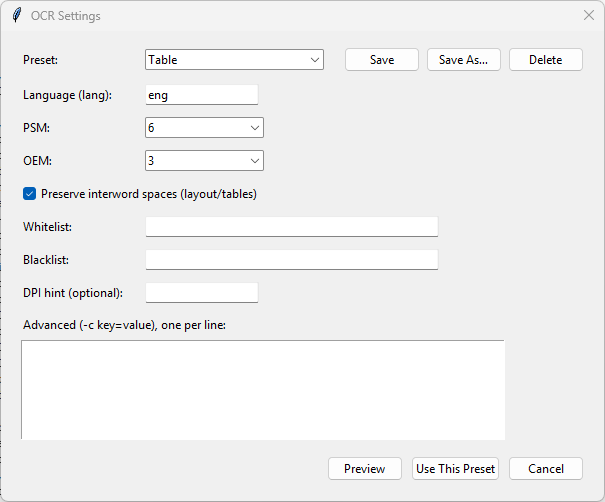

<!-- IMAGE: Snipping overlay selection -->


# Data Snipper

A GUI application for scraping text and data from screengrabs that combines an OCR notepad and an integrated tool to convert charts to data.

Find a table, chart or text on screen that you want to capture as text or data and snip it

<!-- IMAGE: Snipping overlay selection -->


Text snips (including tables) get appended immediately into a text notebook, which you can hand tweak

<!-- IMAGE: Main app window -->


Chart snips allow you to pick out individual series for various chart type after following some simple setup steps. You can append the data in the notepad or save to CSV.

<!-- IMAGE: OCR configuration -->



## Install

Install python then in the terminal:

```bash
pip install mss pillow pytesseract
pip install opencv-python
```

Tesseract must be installed separately (pytessseract is just a binding). On Windows, Tesseract builds can be found here:
- https://github.com/UB-Mannheim/tesseract/wiki

## Run

```bash
python snipper.py
```

## Running with UV

Use uv to replace pip, venv, and pip-tools with a single, extremely fast tool that creates fully reproducible Python environments in seconds.

```bash
uv venv
uv pip install -e .
uv run python snipper.py
```

You can create Windows builds with PyInstaller and UV using the following commands for a single-file executable:

```bash
uv pip install -e .[build]
.\build_windows.ps1 -OneFile
```

Or replace -OneFile with OneDirSfx for an installable MSI (requires WiX Toolset v3.x). Use -WixPath if WiX is not on PATH (for example `-WixPath "C:\\Program Files (x86)\\WiX Toolset v3.11\\bin"`).

## Versioning and changelog

- Version lives in `VERSION` and is embedded into the Windows EXE.
- Release notes live in `CHANGELOG.md`.

## Text snipping workflow

1. Click **Text snip** and drag-select the region of text you wish to convert from image to text.
2. The text will be appended to the end of the notebook
3. If you don't like the output, delete it and try again.
4. You can use the OCR settings panel to tune your output using tesseract configuation.

<!-- IMAGE: OCR configuration -->


## Chart snipping workflow

1. Open a chart image in your viewer of choice, then in snipper, click **Chart snip** and drag-select the chart region in your viewer.
2. Setup the chart for data point detection:
   - Toolbar: **Set region**: The part of the chart that contains series data. Defaults to the full image snip.
   - Toolbar: **Set X axis**: click twice for any pair of x-axis tick marks; enter x0/x1 values. These do not restrict what is scanned only how values are converted from pixels to x-axis units or categories.
   - Toolbar: **Set Y axis**: click twice for any pair of y-axis pixels; enter y0/y1 values. These do not restrict what is scanned only how values are converted from pixels to y-axis units.
   - Chart type: Line/Area/Column/Bar/Scatter supported (if you have combo charts you can change this for each series type in the chart)
   - Stacked: Check for stacked Line/Area/Column values
   - Stride: Select a categorical axis or fixed step (affects calibration)
   - Span mode: checked measures the length of the column/bar/area rather than distance from the axis
   - Calibration: Specify axis scales and the categories or the x0/x1 bounds and step size for the x-axis. Dates aer also supported
3. Toolbar: change tool to **Add series**: 
   - click on the lines in the chart image to add one series at a time to the Series list. 
   - You can edit the parameters above between clicks.
4. Toolbar: change tool to **Edit series** to edit:
   - Click on the individual series in the Series list
   - Drag points vertically (line mode) to adjust values.
   - Right-click a point to toggle NA (disabled).
5. Series list
   - Click series to change the active series
   - Double click on series to change names
   - Delete to drop the series (easy to add again via the "add series" tool)
   - "Toggle on/off" to off excludes from notebook append or CSV export
6. Export:
   - **Append CSV** appends to the notepad in the main window.
   - **Export CSV…** saves a CSV file.

Notes:
- Line charts export in **wide** format with a shared x-index.
- Scatter charts export in **long** format of stacked series with x,y pairs.
